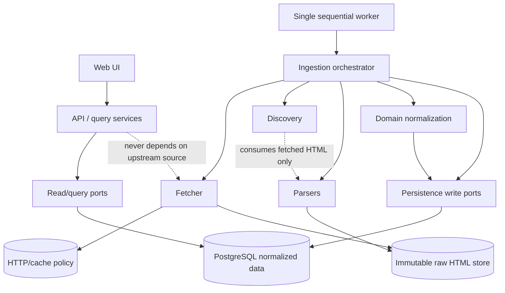
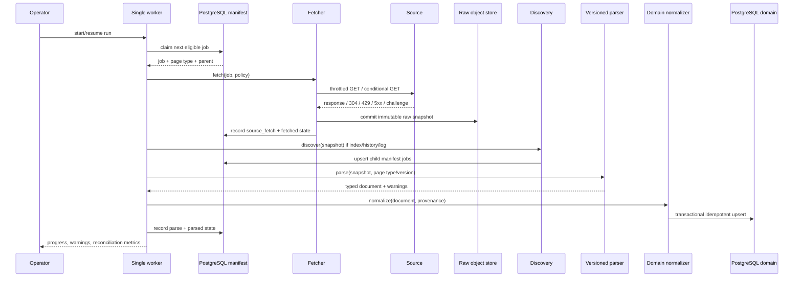
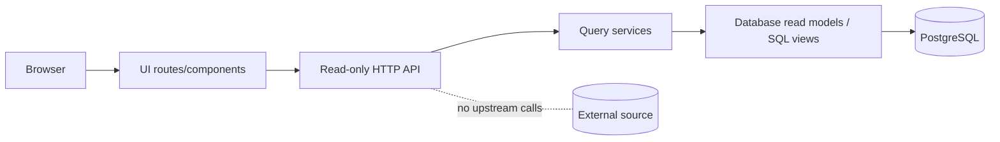
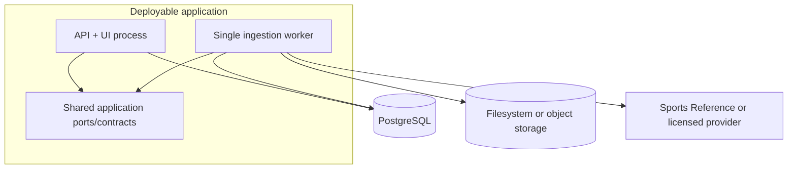

# Web Scraper Architecture Design

## Context

Build the source-agnostic, sequential, resumable men's college-basketball ingestion system described in `SCRAPING_PLAN.md` as one deployable application with six internal boundaries: Fetcher, Discovery, Parsers, Domain normalization, Persistence, and API/UI. The initial deployment uses one database-backed worker, PostgreSQL for crawl state and normalized data, and filesystem/object storage for immutable raw HTML; it does not introduce microservices or a message broker. User-facing requests read only local data and never initiate upstream scraping.

The architecture must preserve provenance, idempotency, resumability, parser reprocessing from stored HTML, conservative upstream request behavior, and reconciliation of games discovered from both teams.

## Approach

### 1. Establish the composition root and dependency direction

Create one application composition root that wires the worker, query API, UI, source adapter, raw-object store, PostgreSQL repositories, parser registry, and reconciliation reporting. Keep the six named boundaries as packages/modules with explicit ports; implementations are selected only at the composition root.

Enforce this dependency graph:



Use dependency inversion at every external edge:

- Fetcher depends on an `HttpTransport`, clock, retry/throttle policy, and `RawObjectStore` port; it must not know parser or domain types.
- Discovery and parsers are pure transformations over a fetched snapshot and page-type context; they must not make HTTP calls or write PostgreSQL directly.
- Domain normalization depends on domain repositories/ports, not PostgreSQL details.
- API/UI depends on read-only query ports; it has no fetcher, source adapter, or crawl-job mutation dependency.
- Persistence implements the ports for PostgreSQL and raw storage. No reverse dependency from persistence into domain or API.

Package by boundary/feature rather than creating global controller/service/model buckets. Export only port interfaces, data contracts, and the orchestrator entry points; keep adapters and mapping helpers private.

### 2. Define the source and page contracts before implementing adapters

Represent the upstream provider behind a `SourceAdapter` contract so Sports Reference can be replaced if permission is unavailable. The adapter supplies canonical URLs and page-type classification; it must follow published links and never synthesize box-score URLs from dates or names.

Use these load-bearing contracts (names may be adapted to the repository language, but semantics and fields are fixed):

```text
SourceAdapter
  indexUrl() -> SourceUrl
  classify(path) -> PageType
  canonicalize(url) -> CanonicalSourcePath

Fetcher
  fetch(job: CrawlJob, policy: RequestPolicy) -> FetchOutcome

Discovery
  discover(pageType: PageType, snapshot: RawSnapshot) -> DiscoveryResult

VersionedParser<T>
  pageType() -> PageType
  version() -> ParserVersion
  parse(snapshot: RawSnapshot) -> ParseResult<T>

Normalizer
  normalize(document: ParsedDocument, context: NormalizationContext) -> NormalizedPage

Persistence
  claimNextJob(now) -> CrawlJob | none
  recordFetch(snapshot metadata) -> SourceFetchId
  recordParse(parse run) -> ParseRunId
  commitPage(normalized page, provenance) -> void
  transitionJob(job id, state, details) -> void

Queries
  list schools/seasons/games and fetch detail projections -> read models
```

Define `PageType` values for the actual intake chain: `school_index`, `school_history`, `season`, `game_log`, and `box_score`. Define one versioned parser registration per page type, with parser versions recorded in `parse_runs` and on every normalized record.

The source-neutral document contracts must preserve:

- linked source paths and canonical source URLs;
- explicit nulls for absent/unavailable values, never zero substitution;
- unlinked opponents and players with nullable source identities;
- home/away/neutral, game type, overtime, canceled/rescheduled/incomplete status;
- all source-fetch identifiers, parsed timestamps, and parser versions.

Before bulk ingestion, require a permission/license gate and a completed data contract: exact retained season/box-score fields, attribution, redistribution, retention, and source-link requirements. If permission is unavailable, select a licensed provider by implementing the same source adapter and page contracts; do not weaken the internal boundaries.

### 3. Implement the Fetcher as the only upstream side-effect boundary

The Fetcher owns HTTP GETs, host-level scheduling, cache lookup, conditional requests, bounded retries, and raw-response persistence. Discovery, parsers, normalization, API handlers, and UI code must never call the network.

Configure the initial provider policy exactly as specified:

- one global worker for the host and no concurrent requests;
- at least six seconds between request starts, no more than 10 requests/minute;
- transparent `User-Agent` containing application name and contact address;
- cache every successful response and use `ETag`/`Last-Modified` conditionals;
- on `429`, honor `Retry-After`; if absent, suspend instead of aggressively retrying;
- on `403`, CAPTCHA, or another challenge, stop and require operator review;
- never rotate IPs, proxies, or user agents to bypass restrictions;
- bounded exponential backoff for transient network errors and `5xx` responses;
- calculate and report unique manifest URL count before box-score backfill.

Commit a successful raw response and its metadata before exposing it to parsing. Preserve immutable snapshots keyed by checksum/object path; a `304` reuses the prior successful snapshot and records the conditional fetch metadata without creating a new HTML body.

Return typed outcomes for fetched, not-modified, retry-wait, permanently-failed, and operator-stop cases. A failed fetch must retain status, attempts, next allowed time, and last error in `crawl_jobs`; it must not be silently marked parsed.

### 4. Make Discovery a staged, link-following manifest builder

Discovery consumes only raw snapshots and emits durable crawl jobs plus source observations through the orchestrator. It must select actual links, not infer URLs from ranges or display names.

Process stages in this order:

1. Parse the men's schools table from `/cbb/schools/`; accept rows only when `To == 2026`, and retain school path, display name, city/state, `From`, `To`, aggregate fields, eligibility decision, source URL, and fetch timestamp.
2. For each eligible school, parse its men's history page and retain only linked seasons with ending years in `{2022, 2023, 2024, 2025, 2026}`. Record a missing linked season as unavailable, not as a crawl failure.
3. Queue each retained season page and discover its actual game-log link and selected season tables.
4. Queue game-log pages and emit every row, including incomplete rows and nullable fields.
5. Emit each present box-score link under a unique canonical source path. Duplicate discovery from the two team logs must be harmless.

The manifest is the durable handoff between stages. Parent/child URLs and page types remain on each job so a crash can resume and operators can inspect why a job exists. Jobs are deduplicated on canonical source path plus the page identity needed by the data contract; box-score canonical path is the authoritative uniqueness key for box-score work.

### 5. Build versioned parsers with quarantine on layout mismatch

Implement one parser per `PageType`, registered by `(page type, parser version)`. Parsers extract the agreed source document contract, return typed values plus warnings, and never perform normalization or persistence.

Parser results distinguish:

- valid values;
- explicit unavailable/null values;
- recoverable warnings (for example, an unlinked opponent);
- structural/layout failures that make column meaning uncertain.

A structural failure moves the job to `parse_failed`, records parser version and warnings/error details, and quarantines the page for operator review. Do not shift columns heuristically or silently coerce blank/unavailable to zero. Stored raw snapshots remain available for offline parser upgrades without an upstream refetch.

### 6. Normalize source records into stable basketball identities

The domain-normalization boundary resolves source paths, school aliases, seasons, games, teams, and players. Canonical source paths are external identifiers; display names are labels and cannot be identity keys.

Use idempotent upserts and explicit merge rules:

- `schools` is keyed by canonical school source identity; `school_aliases` maps historical/display variants to the canonical school.
- `school_seasons` is keyed by school plus ending year and records unavailable coverage separately from failed crawl work.
- A box score's canonical source path identifies one `games` record regardless of how many game logs discovered it.
- Each game produces two `game_teams` rows, with team-game stats attached to the correct side; score-derived winner status must agree with the final score.
- Player identities remain nullable when a source player link is absent; do not invent identities from names.
- All normalized writes for one page occur in one database transaction, with source URL, source-fetch ID, parser version, and parsed timestamp on every normalized record.
- Preserve missing, unavailable, blank, and numeric zero as distinct domain states; represent nullable values as null and use status fields where the source distinguishes unavailable/canceled/rescheduled.

When a game is first discovered in one team log and later in the opposing log, merge by canonical box-score path and reconcile both observations rather than inserting a second game. If conflicting facts cannot be safely resolved, retain the provenance and flag the record for reconciliation instead of overwriting silently.

### 7. Implement Persistence as two stores with transactional database boundaries

Use PostgreSQL for the manifest, fetch/parse provenance, normalized basketball data, and reconciliation state. Use filesystem or object storage for immutable raw HTML, selected by deployment configuration through the `RawObjectStore` port.

Create the persistence model from the required tables:

```text
crawl_jobs
source_fetches
parse_runs
schools
school_aliases
school_seasons
season_rosters
players
games
game_teams
team_game_stats
player_game_basic_stats
player_game_advanced_stats
```

Required persistence behavior:

- durable job states are `pending -> fetching -> fetched -> parsed`, with `retry_wait` and `permanently_failed` from fetch, and `parse_failed` from parsing;
- claiming a job is transactional so one worker owns it at a time; lease/claim recovery must return abandoned `fetching` work to retryable state after the configured claim timeout;
- every fetch records URL, HTTP status, fetch time, validators, checksum, and raw-object path;
- every parse records parser name/version, source fetch, status, warnings, and failure details;
- unique constraints make repeated importer runs and duplicate box-score discovery idempotent;
- normalized page writes and final job transition commit atomically; raw HTML is already committed before that transaction;
- successful historical pages are not routinely refetched, while parser versions can reprocess existing raw snapshots offline.

Do not expose PostgreSQL rows directly to API/UI. Map persistence records to stable read models so schema changes do not become an accidental public contract.

### 8. Orchestrate one sequential, resumable ingestion worker

The orchestrator is the only component allowed to coordinate Fetcher, Discovery, Parsers, Normalizer, and Persistence. It repeatedly claims the next eligible manifest job, enforces parent completion, applies the Fetcher policy, persists the raw snapshot, parses it, normalizes it, commits one-page writes transactionally, and advances or records the durable state.



The worker must stop for operator review on challenge responses, pause on missing permission, and resume from durable states after crashes. A dry-run builds the manifest, counts unique URLs, reports unavailable seasons, and projects runtime without fetching every box score.

### 9. Expose a read-only API/UI over local projections

Add the API/UI only after the backfill is reconciled. API handlers call query services backed by PostgreSQL read ports; they must not call `SourceAdapter`, `Fetcher`, `Discovery`, or mutation repositories.

Expose resource-oriented read operations for the normalized data, at minimum:

- schools and eligible-school metadata;
- a school's available/unavailable target seasons;
- season team summary, roster, and selected aggregate tables;
- games with both participating teams, scores, status, venue, and provenance/source link;
- game detail with line scores, team totals, and player basic/advanced statistics;
- reconciliation/ingestion health for operators, without allowing user requests to mutate crawl state.

Render null/unavailable/status values distinctly from numeric zero. Include attribution and source links required by the granted permission or data license. If filtering/pagination is added, implement it in query services and database projections rather than reaching upstream.



### 10. Add reconciliation and operational boundaries before bulk execution

Generate reconciliation reports from PostgreSQL after each stage and before the application layer is enabled. Reports must verify:

- eligible-school count equals index rows with `To == 2026`;
- no accepted season is outside ending years `2022`–`2026`;
- discovered season count equals linked target-season rows per school;
- each completed game-log row with a box-score link resolves to one game;
- one canonical box-score URL creates one game only;
- two-sided game-log discovery merges into one game, two team-game rows, and associated stats;
- winner agrees with final scores;
- box-score team totals agree with game-log totals;
- blank, unavailable, null, and zero remain distinct;
- canceled, rescheduled, neutral-site, and overtime games remain representable;
- layout changes quarantine affected pages instead of silently shifting columns.

Emit structured logs and counters for request starts, cache hits/304s, throttling pauses, retry waits, challenge stops, parse warnings/failures, job-state counts, duplicate discoveries, merge conflicts, and reconciliation failures. Keep these operational concerns at the worker/application boundary; they must not leak into parser or domain contracts.

The resulting deployment topology remains intentionally small:



Do not split these boundaries into separately deployed services until throughput, independent scaling, or operational ownership requires it; the current six-second global host throttle is easiest to enforce with one worker and one manifest.

## Critical files & anchors

- `SCRAPING_PLAN.md:46-75` — authoritative six-boundary architecture and initial single-deployable topology.
- `SCRAPING_PLAN.md:77-156` — ordered discovery/fetch stages, link-following rules, nullability, and box-score deduplication.
- `SCRAPING_PLAN.md:158-179` — crawl/provenance and normalized data model plus provenance requirements.
- `SCRAPING_PLAN.md:181-225` — responsible request policy and durable job-state/resumability invariants.
- `SCRAPING_PLAN.md:227-265` — reconciliation checks, fixtures, and delivery sequencing.

## Verification

Review the implementation against the following concrete checks in a clean environment, before any bulk run:

1. Run the repository's formatter/typechecker/build command from the project root after implementation; it must complete without errors. Use the package-manager command defined by the eventual project manifest; if no manifest exists yet, run the language-specific compile/typecheck command chosen during scaffolding.
2. Execute a worker smoke run against representative raw fixtures for index, history, season, game-log, and box-score pages. Expected result: only eligible `To == 2026` schools and linked ending years `{2022..2026}` enter the manifest; absent linked seasons are marked unavailable; no network call occurs during parsing or normalization.
3. Exercise a duplicate box-score link from two game-log fixtures. Expected result: one canonical `games` row, two `game_teams` rows, one set of associated player/team stats, and both discovery observations retained or reconciled without a duplicate.
4. Re-run the same import against the same raw snapshots. Expected result: no additional normalized rows, no duplicate manifest entries, and provenance remains tied to the existing source fetch/parser version.
5. Kill and restart the worker after a job is claimed but before parse commit. Expected result: the durable claim timeout makes the job retryable and the resumed run continues from the manifest rather than restarting discovery.
6. Feed a `429` with `Retry-After`, a challenge/`403`, a transient `5xx`, and a conditional `304` through the Fetcher transport seam. Expected result: the first waits according to the header, the second stops for operator review, the third uses bounded retry/backoff, and the fourth reuses the prior immutable raw snapshot.
7. Feed a layout-shift fixture and rows containing blank, unavailable, null, and numeric zero values. Expected result: the layout-shift page is quarantined as `parse_failed`; the four value states remain distinguishable in normalized reads.
8. Query the API/UI while the worker is stopped. Expected result: responses are served from PostgreSQL only, include required attribution/source links, and never create or claim an upstream crawl job.
9. Run the reconciliation report suite after the fixture run. Expected result: all invariants in `SCRAPING_PLAN.md:227-243` pass, or failures identify the exact quarantined/conflicting records.

## Assumptions & contingencies

- The project currently exposes no implementation language, framework, package manifest, or database migration layout; the first implementation pass must choose conventions consistent with the language/framework selected for scaffolding while preserving the contracts and dependency direction above.
- If written permission for Sports Reference is not obtained, keep the same Fetcher/Discovery/Parser/Normalizer/Persistence/API/UI interfaces and configure a licensed provider adapter instead of running the Sports Reference bulk crawl.
- If the eventual raw storage backend cannot provide atomic object creation, write content to a content-addressed temporary object and finalize it before recording `source_fetches`; never mark a page fetched without a durable raw snapshot.
- If PostgreSQL support for a desired read projection is unavailable, use parameterized query services over the normalized tables; do not let API/UI access upstream or bypass provenance.
- If a parser cannot resolve a source identity, retain the record with a nullable identity and provenance; do not manufacture a key from display text.
- If two observations of a canonical game conflict, preserve both provenance records and quarantine the merge for reconciliation; do not silently select one value.
